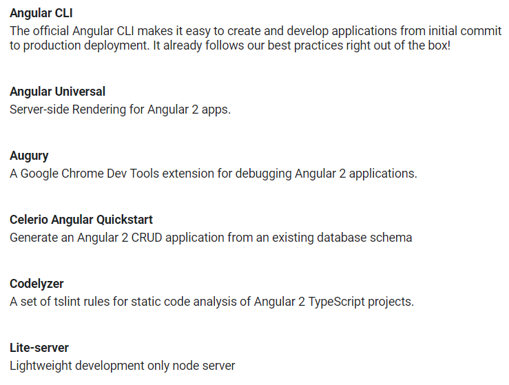
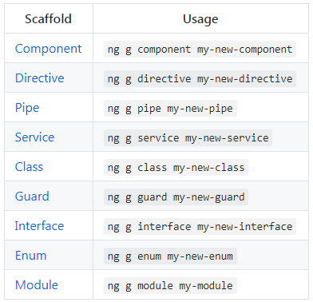

## Angular 7.0 프로그래밍 (2021.05.31)

### 1. Client side - Node.js 14 버전 설치 / 패스 설정

- node -v, npm -v로 설치 및 패스 확인
- npm(node package manager) 약자
- 기존에 자바스크립트 라이브러리를 가져 올때는 `\<script src="xxx.jquery.min.js">`처럼 CDN(Content Delivery Network)방식 또는 경로 설정 등을 이용해 임포트 했다.
  - npm에서는 `npm install jquery`과 같은 명령어로 로컬에 설치
  - node_modules 폴더에 다운로드 받아짐 
  - [NPM](https://www.npmjs.com/) 공식 사이트에서 라이브러리 검색 및 사용 방법 등 확인 가능
    - < = > 자바 진영은 [MAVEN](https://mvnrepository.com/ ), 파이썬 진영은 [PIP](https://pypi.org/)
- Angular에서 제공하는 HTTP는 [ReactiveX](http://reactivex.io/)(마이크로소프트에서 제작, observable streams을 이용 함)
  - 서버와 AJAX(Asynchronous Javascript And XML) 통신
  - 서버에서는 JSON, XML 형식으로 Data만 제공
  - AJAX Javascript는 Cross browser 코딩이 필요
    - jquery.axax()는 Cross browser를 자동화
    - 요즘 추세는 axios, rxjs(ReactivexJavascript) 
    - Angular에서는 서버와 통신 할때는 HTTP 클라이언트에서는 rxjs를 사용해야 함
- SPA(Single Page Application) - Angular, React.js, Vue.js 모두 마찬가지
  - index.html 딱 하나만 있음
  - 화면 전환 기능 : Routing / Router

#### 2. 개발을 위한 TOOL



##### VSCode plug in 설치

- [Angular Essentials (Version 12)](https://marketplace.visualstudio.com/items?itemName=johnpapa.angular-essentials)

  - 유용한 도구 모음
  - install -> VSCode 열기 - Install
  - 또는 Extientions에서 검색해도 가능

- [IntelliSense for CSS, SCSS class names](https://marketplace.visualstudio.com/items?itemName=gencer.html-slim-scss-css-class-completion)

  - CSS 클래스 이름 자동화 도구
  - install -> VSCode 열기 - Install
  - 또는 Extientions에서 검색해도 가능

- [Angular CLI](https://angular.io/cli)

  - 프레임워크 별 CLI
    - Angular : Angular CLI
    - Vue : Vue CLI
    - Reactjs : Create-React-App
  - Client Project 코드와 설정 파일을 자동으로 생성해주는 라이브러리
    - 1. JavaScript 컴파일러 사용
         - javascript 컴파일러 역할을 하는 [Babel ](https://babeljs.io/) 사용
         - Reactjs, vue - ECMAScript6 사용
           - ECMA(ECMA(European Computer Manufacturers Association)
           - 최초 ECMA 스크립트는 브라우저 언어인 Javascript 와 Jscript 간 차이를 줄이기 위한 공통 스펙 제안으로 출발 (1997, ECMA 262)
         - Angular - Typescript 사용
         - ES5와 ES6간 문법 차이가 크기 때문에 최신 브라우저가 아니면 ES6 해석이 안됨, ES6 및 TS를 ES5로 변환해야 함
           - 일일이 컴파일을 해주지 않아도 되도록 이를 CLI가 해줌
      2. 번들링 기능 제공, 클라이언트를 위한 Dev Server필요
         - 내부에서 [Webpack](https://webpack.js.org/) 사용
         - 2.1 번들링
           - 개발자 작성 코드는 .ts 확장자인 모듈로 작성하게 됨
           - 여러개의 ts 파일을 한꺼번에 합쳐서(bundling) 배포
           - import 하면 node_modules 밑에 다운로드 받아진 실제 라이브러리 .js들을 합쳐서(bundling)하여 배포
           - 페이지에서는 bundling  된 dist/bundle.js 하나만 임포트하면 됨
         - 2.2 클라이언트를 위한 Dev Server 필요
           - Source 수정시 새로고침 없이도 바로 브라우저에 적용 (Hot Module Replcaement)

  <br/>

##### Chrome tool

- [Augury](https://chrome.google.com/webstore/search/augury?hl=ko&) 

  - 크롬 확장프로그램에서 설치 - 크롬에 추가

  - 크롬 개발자 도구 상에서 Angular 컴포넌트 현황 Assist

<br/>

- [Postman - Rest API Clinet Tester](https://chrome.google.com/webstore/detail/postman/fhbjgbiflinjbdggehcddcbncdddomop?hl=ko)
  - 크롬 확장프로그램에서 설치 - 크롬에 추가
  - chrome app에 아이콘 생김
  - Take me straight to the app을 누르면 로그인 없이 이용 가능
    - 다운로드 -> Download the App

<br/>

### 3. CLI를 이용한 프로젝트 생성 및 실행

- Angular CLI 는 Node 6.9.0 이상 , NPM 3 이상에서 가능
- `-g` 옵션을 주면 node_modules에 설치되어 전체 사용 가능
  - package.json은 node.js 의존성 (dependency) 설정을 위한 파일
    - `npm i rxjs` 명령어로 설치하는 작업을 package.json에 명시함으로써 이를 자동화 해줌
    - `npm i --save rxjs`와 같이 `--save` 옵션을 주면 설치하면서 package.json에 기록함
      - 이렇게 package.json에 명시 할 경우 프로젝트 공유 할 때 node_modules 폴더 삭제 후 공유할 수 있음
      - 받은 사람은 `npm install`을 이용해 설치

<br/>

``` javascript
//Angular CLI 설치
npm install -g @angular/cli

//프로젝트 생성 (ng new)
ng new [프로젝트명]
//기본 구조 , 컴포넌트 생성 , 빌드 , 유닛 테스트 , 개발서버 , 배포에 관련된 모든 의존성 라이브러리를 설치합니다
//router 사용 여부, CSS 종류 여부 선택 가능

    ============================================    
//개발서버 실행 (ng serve)
// 개발모드(dev mode)로 컴파일, 번들링, 개발서버 시작을 해주는 명령어

cd [프로젝트명]
ng serve


//Webpack 빌드과정이 끝나면 http://localhost:4200 접속하면 개발서버를 확인할 수 있습니다
//vendor.js -> 번들링 된 파일
//main.js -> 개발자가 코딩한 코드 번들링 된 파일
//polyfills -> 브라우저 호환성을 위한 파일
//serve 명령어 완료 시
============================================================
Initial Chunk Files   | Names         |      Size
vendor.js             | vendor        |   2.08 MB
polyfills.js          | polyfills     | 508.84 kB
styles.css, styles.js | styles        | 381.02 kB
main.js               | main          |  52.71 kB
runtime.js            | runtime       |   6.60 kB

                      | Initial Total |   3.01 MB

Build at: 2021-05-31T02:54:27.156Z - Hash: ddbdfb7c2b956867a7ae - Time: 20973ms

** Angular Live Development Server is listening on localhost:4200, open your browser on http://localhost:4200/ **


√ Compiled successfully.
============================================================
```

<br/>

#### ng serve 명령어 이후 실행 순서

- http://localhost:4200에서 개발 서버 구동

  - main.ts 웹팩의 설정으로 인해서 가장 먼저 시작됨                 

  - ```javascript
    			 1-5)src/main.ts (index.html)과 angular 컴포넌트 연결
    1)src/index.html ==> 2)src/app.module.ts  ==> 3)src/app.component.ts
    // app.component가 root component 역할을 한다.
    4)index.html - body태그내의 '<app-root></app-root>' 내용이 출력 됨
    ```

  - **Component 3종 세트**

    - src/app.component.ts : typescript로 작성한 JS 코드
      - selecetor : `app-root`
      - 이곳에 하위 컴퍼넌트들을 만들게 됨

    - src/app.component.html : template - html로 작성한 화면

    - src/app.component.css : Style - CSS로 작성한 스타일

<br/>

- 컴포넌트 , 디렉티브 , 서비스 , 파이프 생성(ng generate)

```javascript
//컴포넌트 , 디렉티브 , 서비스 , 파이프 생성 (ng
ng generate component [ 컴포넌트명 ] 또는
ng -g component [컴포넌트명]

/*src /app 컴포넌트명 ] 아래 4 개의 파일이 생성됩니다
[
컴포넌트명 ].component.css
컴포넌트명 ].component.html
컴포넌트명 component.spec.ts
컴포넌트명 component.ts */
```

<br/>

- ​	디렉티브 , 서비스 , 파이프 , 클래스 등 같은 형태로 쉽게 폴더 구조 및 파일을 생성할 수 있습니다



- ```javascript
  //빌드 (ng build)
  //운영 모드(prod mode)로 배포를 위한 컴파일, 번들링을 위한 명령어,
  //생성 된 파일을 실서버의 static 폴더에 배포하게 됨
  ng build
  
  //dist / 폴더에 실제 서비스를 위한 파일이 생성됩니다
  
  //웹 문서 열기 (ng doc)
  ng doc [keyword]
  
  //CLI 를 통해서 Angular 2 웹 사이트 내에 API Reference 의 검색결과 페이지를 열어줍니다
  ```

<br/>


#### *  Server side - STS, JDK11 설치 /  패스 설정

- 스프링 부트로 구성 예정

<br/>

