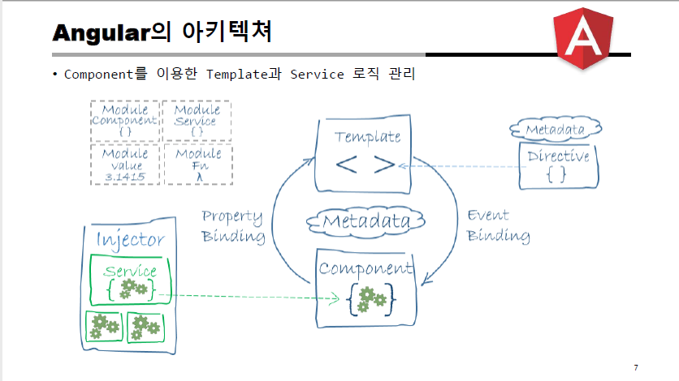

## Angular 7.0 프로그래밍 (2021.05.31)

### 1. Angular 구조



<br/>

#### Framwork와 Library의 차이

- Library : 함수를 호출해서 개발자가 주도적으로 사용하는 것
- Framework : 라이브러리의 역할도 하지만 개발자의 코드를 역으로 제어 함
  - IoC(Inversion of Control) : 제어의 역전
  - 개발자가 작성한 클래스를 객체를 생성해서 주입(Injection)을 해준다.
- 호출 제어의 흐름을 누가 관장하는지가 차이

- Service 객체를 new 하여 생성하지 않고 Injector에서 주입하여 사용하게 됨 

<br/>

### 2. 프로젝트 폴더 구조 설명

#### assets

- 정적 자원, imgs 등

<br/>

#### environments

- environmentprod.ts
  - 운영 모드에서의 설정
- environment.ts 
  - 개발 모드에서의 설정

<br/>

#### polyfills.ts

- 브라우저 호환성을 잡아주는 역할

<br/>

#### styles.css

- src/styles.css에 작성한 스타일은 모든 컴포넌트에 적용 됨
- app.component.css 는 app.compononet.html에만 적용 됨

<br/>

#### angular.json

- Bootstrap과 같은 오픈 소스를 가져와서 스타일을 쓰고 싶을 때 여기에 설정을 해줌

<br/>

#### package.json

- npm install시 node_modules에 설치할 의존성 관리

<br/>

#### tsconfig.json

- Typescript 컴파일 할때 적용 할 옵션 관리

<br/>

#### 컴포넌트 만들기

```shell
ng generate component heroes
```

<br/>

#### heroes.component.ts

```typescript
import { Component, OnInit } from '@angular/core';

@Component({
  selector: 'app-heroes',
  templateUrl: './heroes.component.html',
  styleUrls: ['./heroes.component.css']
})
export class HeroesComponent implements OnInit {
    //변수 선언
  hero = 'WindStrom';

  constructor() { }

  ngOnInit(): void {
  }

}
```


<br/>

#### heroes.component.html

```html
<h1>{{hero}}</h1>
<!-- heroes.component.ts에서 지정 된 selector 태그를 호출-->
<app-heroes></app-heroes>
```

<br/>

#### 호출 계층 구조

- index.html
  - app.component.ts : \<app-root> root 컴포넌트
  - heroes.component.ts : \<app-heroes> 컴포넌트

<br/>


### 3. [Angular LifeCycle](https://angular.io/guide/lifecycle-hooks)

<br/>

#### 1. app.component.ts

```typescript
import { Component } from '@angular/core';

@Component({
  selector: 'app-root',
  templateUrl: './app.component.html',
  styleUrls: ['./app.component.css']
})
export class AppComponent {
  title = 'Tour of Heroes';

  constructor(){
    console.log("AppComponent 생성자 호출 됨")
  }
}

```

<br/>

#### 2.heroes.component.ts

```typescript
import { Component, OnInit } from '@angular/core';

@Component({
  selector: 'app-heroes',
  templateUrl: './heroes.component.html',
  styleUrls: ['./heroes.component.css']
})
export class HeroesComponent implements OnInit {
  hero = 'WindStrom';

  constructor() {
    console.log("HeroesComponent 생성자 호출 됨");
}
  ngOnInit(): void {
    console.log("HeroesComponent ngOnInit 메서드 호출 됨");
  }

}

```

<br/>

#### 3. heroes.component.html

```typescript
<h1>{{hero}}</h1>
<app-heroes></app-heroes>
```

<br/>

### 4. Pipe

```html
<h1>{{hero.name|uppercase}}</h1><!-- 대문자로 출력-->
<h1>{{hero.name|titlecase}}</h1><!--첫글자만 대문자로 출력-->
```

- 사용자 정의 PIPE도 이용 가능
- [Angular API Reference](https://angular.io/api)에서 사용 가능한 사전 정의 된 PIPE에 대해 확인 가능

- Pipe 를 사용하면 템플릿 HTML 에서 표시 값 변환을 선언 할 수 있다 
- Angular 는 날짜 파이프 및 통화 파이프와 같은 다양한 파이프를 정의
- HTML 템플리트에서 값 변환을 지정하려면 파이프 연산자 사용
- interpolated_value | pipe_name
- @Pipe 데코레이터가 있는 클래스는 입력 값을 출력 값으로 변환하여 뷰에 표시하는 함수를 정의
- 사용자 정의 데코레이터 클래스를 작성할 수 있다